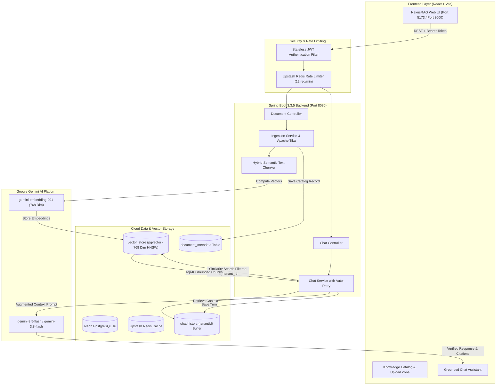

# NexusRAG — Multi-Tenant AI Knowledge Platform

A full-stack, enterprise-grade Retrieval-Augmented Generation (RAG) platform with multi-tenant vector isolation, powered by **Spring AI**, **Google Gemini**, **PostgreSQL (Neon) with pgvector**, **Upstash Redis**, and **React (Vite)**.

---

## 🏗️ System Architecture



---

## 🚀 Key Features

1. **Multi-Tenant Vector Space Isolation**:
   - Every ingested chunk is stamped with `tenant_id`.
   - Vector similarity lookups enforce strict tenant filtering to prevent cross-tenant data leakage.
2. **Spring AI & Gemini Integration**:
   - Chat Completion: `gemini-3.5-flash` with automatic exponential backoff retry.
   - Semantic Embeddings: `gemini-embedding-001` (768 dimensions).
   - Vector Store: `pgvector` with HNSW cosine distance indexing on Neon PostgreSQL.
3. **Redis Caching & Multi-Turn Buffer**:
   - Upstash Redis stores recent conversation turns per tenant for context-aware multi-turn conversations.
   - Sliding-window rate limiter (12 requests/minute) protects against Google Gemini quota exhaustion.
4. **Smart Document Management**:
   - Apache Tika parsing (PDF, DOCX, TXT, Markdown, CSV, JSON).
   - Knowledge Catalog: live document list, chunk counters, status indicators, and one-click deletion (single document or complete catalog reset).
5. **Production Ready & Tested**:
   - Containerized with multi-stage Dockerfiles (`Dockerfile`, `docker-compose.yml`, `render.yaml`).
   - Isolated integration tests powered by **Testcontainers** (`pgvector/pgvector:pg16`).
   - Automated CI/CD pipeline via **GitHub Actions**.

---

## 🛠️ Getting Started

### 1. Environment Variables Configuration

Create a `.env` file in the `ragplatform/` folder or export the following variables:

```bash
# Neon PostgreSQL with pgvector
NEON_DB_URL=jdbc:postgresql://<neon-host>/neondb?sslmode=require
NEON_DB_USER=<neon-user>
NEON_DB_PASSWORD=<neon-password>

# Upstash Redis
UPSTASH_REDIS_URL=rediss://default:<password>@<host>:6379
UPSTASH_REDIS_PASSWORD=<upstash-password>

# Google Gemini API Key
GEMINI_API_KEY=<your-gemini-api-key>
```

---

### 2. Running Locally

#### Run Backend (Spring Boot 3.3.5):
```powershell
.\run-backend.ps1
```
The backend server runs on `http://localhost:8080`.

#### Run Frontend (React + Vite):
```powershell
.\run-frontend.ps1
```
Open [http://localhost:5173](http://localhost:5173) in your browser.

#### Run with Docker Compose:
```bash
docker compose up --build
```
Access the application at `http://localhost:3000`.

---

## 🧪 Testing with Testcontainers

Run isolated integration tests using a transient Docker container running PostgreSQL with pgvector:

```bash
cd ragplatform
mvn test -Dtest=DocumentRepositoryIntegrationTest
```

---

## 📡 API Reference

| Endpoint | Method | Description | Auth Required |
|---|---|---|---|
| `/api/auth/register` | `POST` | Register a new tenant account | No |
| `/api/auth/login` | `POST` | Authenticate and obtain JWT token | No |
| `/api/documents` | `GET` | List all documents for the authenticated tenant | Yes |
| `/api/documents/upload` | `POST` | Upload & ingest document (PDF, DOCX, TXT, MD) | Yes |
| `/api/documents/{id}` | `DELETE` | Delete single document and its vector embeddings | Yes |
| `/api/documents/clear` | `DELETE` | Delete all documents and vectors to start fresh | Yes |
| `/api/chat` | `POST` | Send RAG query with grounded vector context | Yes |
| `/api/chat/history` | `GET` | Retrieve Redis multi-turn conversation history | Yes |
| `/api/chat/history` | `DELETE` | Clear tenant Redis conversation history buffer | Yes |
| `/actuator/health` | `GET` | Health check endpoint | No |

---

## 📖 Engineering Deep-Dive
Read our in-depth technical post: [How I Reduced Hallucinations in RAG with Hybrid Chunking](./docs/how-i-reduced-hallucinations-in-rag-with-hybrid-chunking.md).
